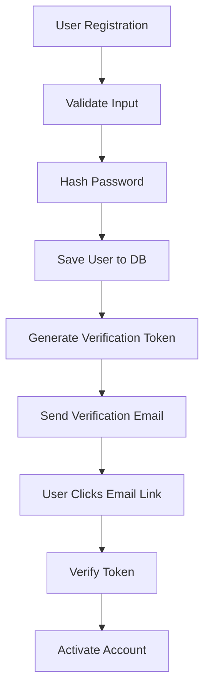
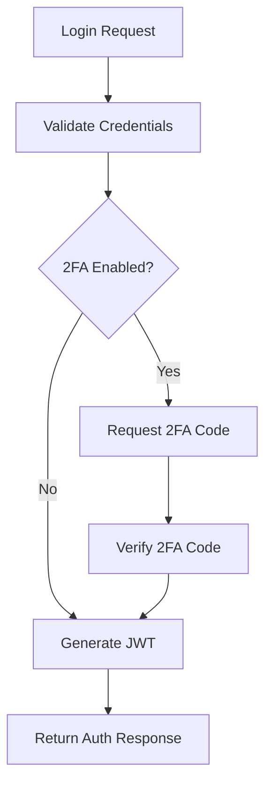

# 🔐 Spring Boot Security Complete Guide

[](https://spring.io/projects/spring-boot)
[](https://www.oracle.com/java/)
[](https://jwt.io/)
[](https://www.postgresql.org/)
[](https://opensource.org/licenses/MIT)

> **Complete Spring Boot Security Guide** - Learn modern security practices with JWT Authentication, Email Verification, Two-Factor Authentication (2FA), and SMTP integration.

## 📚 Table of Contents

- [🎯 About This Project](#-about-this-project)
- [✨ Features](#-features)
- [🛠️ Technologies](#️-technologies)
- [📋 Requirements](#-requirements)
- [⚡ Quick Start](#-quick-start)
- [🔧 Configuration](#-configuration)
- [📖 API Documentation](#-api-documentation)
- [🏗️ Project Architecture](#️-project-architecture)
- [🔍 Detailed Code Review](#-detailed-code-review)
- [📱 Postman Collection](#-postman-collection)
- [🧪 Testing](#-testing)
- [📚 Learning Resources](#-learning-resources)
- [🤝 Contributing](#-contributing)
- [📄 License](#-license)

## 🎯 About This Project

This project is a complete guide for developers who want to learn **Spring Boot Security** implementation in modern web applications. It's designed for real-world scenarios and shows security best practices.

### 🎓 Learning Goals

- How to implement **JWT (JSON Web Token)** authentication
- How to set up an **Email verification** system
- How to integrate **Two-Factor Authentication (2FA)**
- How to configure **Spring Security**
- How to send emails with **SMTP**
- How to integrate **PostgreSQL** database
- What are the **Security best practices**

## ✨ Features

### 🔐 Authentication & Authorization
- **JWT Token-based Authentication**
- **Role-based Authorization** (USER, ADMIN)
- **Password Encryption** (BCrypt)
- **Session Management** (Stateless)

### 📧 Email Integration
- **Email Verification** system
- **SMTP Configuration** (Gmail)
- **HTML Email Templates**
- **Email Token Management**

### 🔒 Two-Factor Authentication (2FA)
- **Google Authenticator** integration
- **QR Code** generation
- **TOTP (Time-based One-Time Password)**
- **Setup and Verification** endpoints

### 🛡️ Security Features
- **CORS** configuration
- **Input Validation**
- **Exception Handling**
- **Security Headers**

## 🛠️ Technologies

### Backend
- **Spring Boot 3.5.3** - Framework
- **Spring Security 6** - Security
- **Spring Data JPA** - ORM
- **Spring Boot Mail** - Email
- **PostgreSQL** - Database

### Authentication & Security
- **JWT (jjwt 0.11.5)** - Token management
- **Google Authenticator (1.5.0)** - 2FA
- **ZXing (3.5.1)** - QR Code generation
- **BCrypt** - Password hashing

### Tools & Utilities
- **Lombok** - Boilerplate code reduction
- **Maven** - Dependency management
- **H2** - Test database
- **Postman** - API testing

## 📋 Requirements

### System Requirements
- **Java 17+**
- **Maven 3.6+**
- **PostgreSQL 12+**
- **IDE** (IntelliJ IDEA, Eclipse, VS Code)

### Email Configuration
- **Gmail account**
- **App Password** (for Gmail accounts with 2FA enabled)

## ⚡ Quick Start

### 1. Clone the Project
```bash
git clone https://github.com/sogutemir/spring-boot-security.git
cd spring-boot-security
```

### 2. Create PostgreSQL Database
```sql
CREATE DATABASE securityExampleDB;
```

### 3. Configure Application.yml File
```yaml
spring:
  datasource:
    url: jdbc:postgresql://localhost:5432/securityExampleDB
    username: your_username
    password: your_password
  
  mail:
    username: your_email@gmail.com
    password: your_app_password
```

### 4. Run the Project
```bash
mvn clean install
mvn spring-boot:run
```

### 5. Test the Application
- **API Base URL**: `http://localhost:8080`
- **Health Check**: `http://localhost:8080/actuator/health`

## 🔧 Configuration

### Database Configuration
```yaml
spring:
  datasource:
    url: jdbc:postgresql://localhost:5432/securityExampleDB
    username: postgres
    password: 123456
    driver-class-name: org.postgresql.Driver
  
  jpa:
    hibernate:
      ddl-auto: update
    show-sql: true
    properties:
      hibernate:
        dialect: org.hibernate.dialect.PostgreSQLDialect
        format_sql: true
```

### JWT Configuration
```yaml
jwt:
  secret: myVeryLongSecretKeyThatIsAtLeast64BytesLongForHS512Algorithm
  expiration: 86400000 # 24 hours
```

### SMTP Configuration
```yaml
spring:
  mail:
    host: smtp.gmail.com
    port: 587
    username: your_email@gmail.com
    password: your_app_password
    properties:
      mail:
        smtp:
          auth: true
          starttls:
            enable: true
```

## 📖 API Documentation

### Authentication Endpoints

#### 🔐 User Registration
```http
POST /api/auth/register
Content-Type: application/json

{
  "email": "user@example.com",
  "password": "securePassword123",
  "firstName": "John",
  "lastName": "Doe"
}
```

#### 🔑 User Login
```http
POST /api/auth/login
Content-Type: application/json

{
  "email": "user@example.com",
  "password": "securePassword123"
}
```

#### ✅ Email Verification
```http
POST /api/auth/verify-email?token=your_verification_token
```

### Two-Factor Authentication Endpoints

#### 🛠️ 2FA Setup
```http
POST /api/auth/2fa/setup
Authorization: Bearer your_jwt_token
```

#### ✅ 2FA Verification
```http
POST /api/auth/2fa/verify-setup
Authorization: Bearer your_jwt_token
Content-Type: application/json

{
  "code": "123456"
}
```

#### 🔐 2FA Login
```http
POST /api/auth/2fa/verify
Content-Type: application/json

{
  "email": "user@example.com",
  "code": "123456"
}
```

## 🏗️ Project Architecture

### 📁 Directory Structure
```
src/main/java/com/babili/springbootsecurity/
├── 🚀 SpringBootSecurityApplication.java
├── ⚙️ config/
│   └── SecurityConfig.java
├── 🎮 controller/
│   ├── AuthController.java
│   └── TwoFactorAuthController.java
├── 📦 dto/
│   ├── AuthResponse.java
│   ├── LoginRequest.java
│   ├── RegisterRequest.java
│   ├── MessageResponse.java
│   ├── TwoFactorSetupResponse.java
│   └── TwoFactorVerificationRequest.java
├── 🗃️ entity/
│   ├── User.java
│   ├── Role.java
│   └── EmailVerificationToken.java
├── ❌ exception/
│   ├── GlobalExceptionHandler.java
│   ├── InvalidTokenException.java
│   ├── TokenExpiredException.java
│   └── UserAlreadyExistsException.java
├── 🗄️ repository/
│   ├── UserRepository.java
│   ├── EmailVerificationTokenRepository.java
│   └── CustomCredentialRepository.java
├── 🔒 security/
│   ├── AuthTokenFilter.java
│   ├── UserDetailsServiceImpl.java
│   └── UserPrincipal.java
├── ⚙️ service/
│   ├── AuthService.java
│   ├── UserService.java
│   ├── EmailService.java
│   ├── EmailVerificationService.java
│   ├── RegistrationService.java
│   └── TwoFactorAuthService.java
└── 🛠️ util/
    └── JwtUtils.java
```

### 🔄 Workflow

#### 1. User Registration Flow


#### 2. Authentication Flow


## 🔍 Detailed Code Review

### 🔐 Security Configuration
The `SecurityConfig.java` file contains the application's security configuration:

```java
@Configuration
@EnableWebSecurity
@EnableMethodSecurity(prePostEnabled = true)
public class SecurityConfig {
    
    @Bean
    public SecurityFilterChain filterChain(HttpSecurity http) throws Exception {
        http
            .cors(cors -> cors.disable())
            .csrf(csrf -> csrf.disable())
            .sessionManagement(session -> 
                session.sessionCreationPolicy(SessionCreationPolicy.STATELESS))
            .authorizeHttpRequests(auth -> auth
                .requestMatchers("/api/auth/**").permitAll()
                .anyRequest().authenticated())
            .addFilterBefore(authenticationJwtTokenFilter(), 
                UsernamePasswordAuthenticationFilter.class);
        
        return http.build();
    }
}
```

### 🎫 JWT Utilities
The `JwtUtils.java` file manages JWT token operations:

```java
@Component
public class JwtUtils {
    private static final Logger logger = LoggerFactory.getLogger(JwtUtils.class);
    
    @Value("${jwt.secret}")
    private String jwtSecret;
    
    @Value("${jwt.expiration}")
    private int jwtExpirationMs;
    
    public String generateJwtToken(Authentication authentication) {
        UserPrincipal userPrincipal = (UserPrincipal) authentication.getPrincipal();
        
        return Jwts.builder()
                .setSubject(userPrincipal.getEmail())
                .setIssuedAt(new Date())
                .setExpiration(new Date((new Date()).getTime() + jwtExpirationMs))
                .signWith(SignatureAlgorithm.HS512, jwtSecret)
                .compact();
    }
}
```

### 📧 Email Service
The `EmailService.java` file handles email sending operations:

```java
@Service
public class EmailService {
    
    private final JavaMailSender mailSender;
    
    public void sendVerificationEmail(String to, String token) {
        try {
            MimeMessage message = mailSender.createMimeMessage();
            MimeMessageHelper helper = new MimeMessageHelper(message, true, "UTF-8");
            
            helper.setTo(to);
            helper.setSubject("Email Verification - Security Example App");
            
            String verificationUrl = frontendUrl + "/verify-email?token=" + token;
            String htmlContent = buildVerificationEmailContent(verificationUrl);
            
            helper.setText(htmlContent, true);
            mailSender.send(message);
            
        } catch (MessagingException e) {
            throw new RuntimeException("Failed to send verification email", e);
        }
    }
}
```

### 🔒 Two-Factor Authentication
The `TwoFactorAuthService.java` file manages 2FA operations:

```java
@Service
public class TwoFactorAuthService {
    private static final String ISSUER = "SecurityExampleApp";
    private final GoogleAuthenticator gAuth;
    
    public TwoFactorSetupResponse setupTwoFactor(String email) {
        User user = userService.findByEmail(email);
        
        GoogleAuthenticatorKey key = gAuth.createCredentials();
        String secret = key.getKey();
        
        // QR Code generation
        String qrCodeUrl = GoogleAuthenticatorQRGenerator.getOtpAuthURL(
            ISSUER, email, key);
        
        return TwoFactorSetupResponse.builder()
                .secret(secret)
                .qrCodeUrl(qrCodeUrl)
                .qrCodeImage(generateQRCodeImage(qrCodeUrl))
                .build();
    }
}
```

## 📱 Postman Collection

The project includes a `Spring_Boot_Security_API_Collection.postman_collection.json` file. This collection contains the following tests:

### 📋 Test Scenarios
1. **User Registration** - New user registration
2. **Email Verification** - Email verification
3. **User Login** - User login
4. **2FA Setup** - Two-factor authentication setup
5. **2FA Verification** - Two-factor authentication verification
6. **Protected Endpoints** - Protected endpoint tests

### 📥 How to Import Postman Collection
1. Open Postman
2. Click the **Import** button
3. Select **Upload Files** option
4. Choose the `Spring_Boot_Security_API_Collection.postman_collection.json` file
5. Click **Import**

## 🧪 Testing

### Unit Tests
```bash
mvn test
```

### Integration Tests
```bash
mvn verify
```

### Manual Testing Flow
1. **User Registration**
    - Use the `/api/auth/register` endpoint
    - Check your email

2. **Email Verification**
    - Click the link in the email or manually send the token

3. **Login**
    - Use the `/api/auth/login` endpoint
    - Get the JWT token

4. **2FA Setup**
    - Use the `/api/auth/2fa/setup` endpoint
    - Add the QR code to Google Authenticator

5. **2FA Login**
    - Try to login with a 2FA-enabled account
    - Get the code from Google Authenticator

## 📚 Learning Resources

### 📖 Spring Security
- [Spring Security Reference](https://docs.spring.io/spring-security/reference/)
- [Spring Boot Security Auto-configuration](https://docs.spring.io/spring-boot/docs/current/reference/html/web.html#web.security)

### 🎫 JWT (JSON Web Tokens)
- [JWT.io](https://jwt.io/) - JWT debugger and libraries
- [RFC 7519 - JWT Specification](https://tools.ietf.org/html/rfc7519)

### 🔒 Two-Factor Authentication
- [RFC 6238 - TOTP Algorithm](https://tools.ietf.org/html/rfc6238)
- [Google Authenticator Integration](https://github.com/wstrange/GoogleAuth)

### 📧 Email Integration
- [Spring Boot Mail](https://docs.spring.io/spring-boot/docs/current/reference/html/io.html#io.email)
- [JavaMail API](https://javaee.github.io/javamail/)

## 🤝 Contributing

This is an open-source educational project. We welcome your contributions!

### 🔧 Development Process
1. **Fork** the repository
2. Create a **feature branch** (`git checkout -b feature/amazing-feature`)
3. **Commit** your changes (`git commit -m 'Add some amazing feature'`)
4. **Push** to the branch (`git push origin feature/amazing-feature`)
5. Open a **Pull Request**

### 📝 Contribution Areas
- 🐛 Bug fixes
- ✨ New features
- 📚 Documentation improvements
- 🧪 Test coverage
- 🔧 Performance optimizations
- 🌐 Internationalization

## 📄 License

This project is licensed under the MIT License. See the [LICENSE](LICENSE) file for details.

---

## 🌟 If You Like This Project

If this project helped you, please support it by giving it a ⭐!

### 📢 Social Media
- **GitHub**: [@sogutemir](https://github.com/sogutemir)
- **LinkedIn**: [Sogut Emir](https://www.linkedin.com/in/sogutemir/)
- **Mail**: muhammet.sogut@tubitak.gov.tr

### 💬 Contact
For questions, you can open an issue or contact me via email: muhammet.sogut@tubitak.gov.tr

---

**Happy Coding! 🚀**

> Enter the world of Spring Boot Security with this comprehensive project and become an expert in security topics for modern web applications!